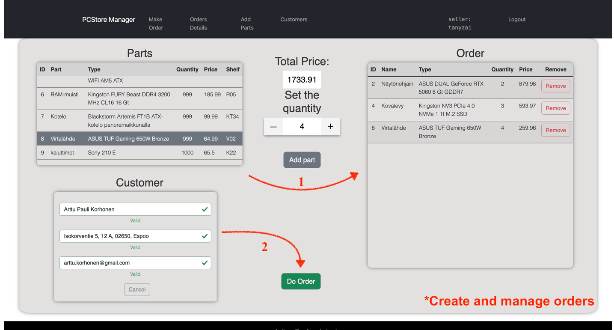
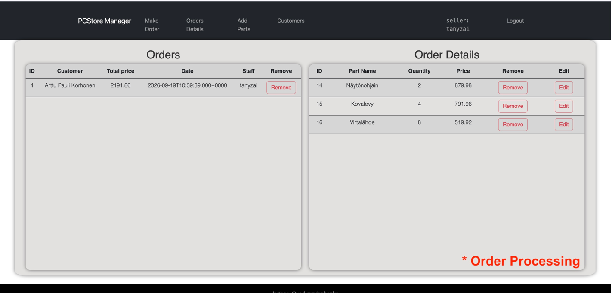
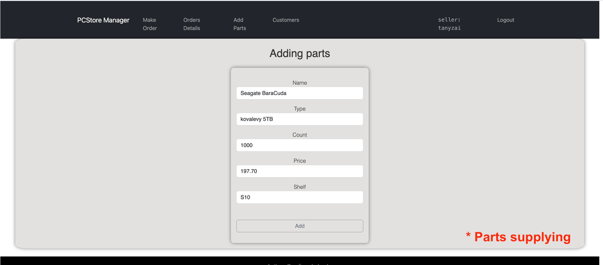
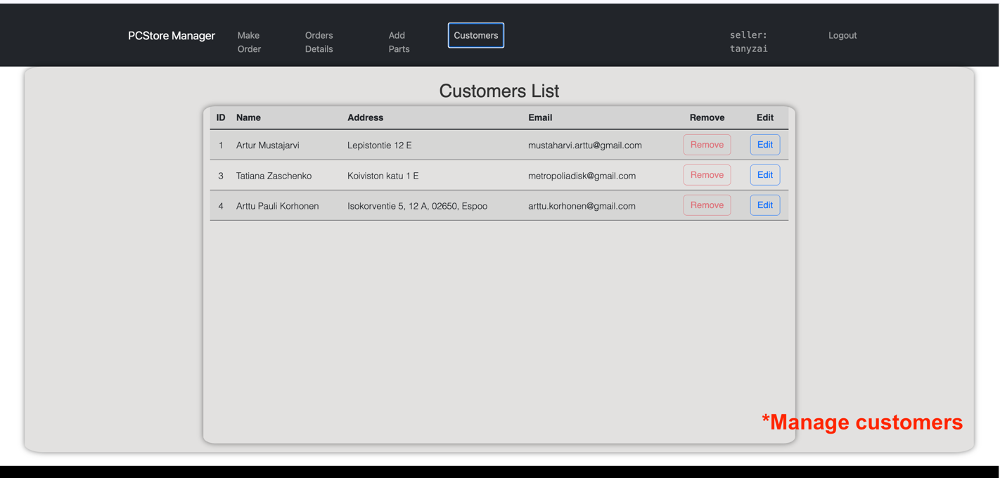

## PCStore Manager

# Overview
PCStore Manager is a web-based warehouse management application designed for a computer parts store. It helps manage inventory, sales, customer orders, packages, and staff.


## Features

- Manage customers and customer information
- Create and manage orders
- Manage computer parts and inventory
- Create and manage packages
- Track stock quantities
- Manage staff and user roles
- Monitor sales and order information






## Getting Started

### Access the Application

The application is available at:

- **Production:** `https://pcstore-manager.uk` — public application
- **Development:** `https://dev.pcstore-manager.uk` — restricted to authorized users for development and testing

### Run Locally

To run the application locally:

```bash
docker compose up -d --build
```
The application will be available at:

http://localhost

## Tech Stack

The application is built with a React frontend, Spring Boot backend, and MySQL database. Docker is used to run the application components in isolated containers.

### Frontend
- React
- JavaScript
- HTML5 / CSS3
- Axios

### Backend
- Java
- Spring Boot
- Spring Data JPA
- Hibernate
- Maven

### Database
- MySQL 8.0

### DevOps & Deployment
- Docker
- Docker Compose
- Nginx
- GitHub Actions
- Oracle Cloud VM

### Architecture
- REST API
- Dockerized services
- Nginx reverse proxy
- CI/CD with GitHub Actions
- Separate Development and Production environments

The application runs in separate Production and Development
Docker environments.

Production Nginx is the public entry point for both domains
and forwards Development traffic to the Dev Nginx container.


```text
Browser
│
▼
Production Nginx
│
├── Production
│     ├── Frontend
│     ├── Backend
│     └── MySQL
│
└── dev-nginx
│
├── Frontend
├── Backend
└── MySQL
```

See the [Architecture Documentation](docs/architecture.md)
for the detailed Docker network and Nginx configuration.

## Project Structure

```text
web-pcstore/
├── backend/                  # Spring Boot backend
│   ├── Dockerfile
│   ├── pom.xml
│   └── src/
│
├── frontend/                 # React frontend
│   ├── Dockerfile
│   ├── nginx.conf
│   ├── package.json
│   └── src/
│
├── nginx/                    # Reverse proxy configuration
│   ├── nginx.conf
│   └── nginx.local.conf
│
├── docs/                     # Project documentation
│   └── architecture.md
│
├── .github/
│   └── workflows/            # GitHub Actions CI/CD
│
├── docker-compose.yml        # Local development
├── docker-compose.oracle.yml # Oracle deployment
└── .env                      # Local environment variables

```
---

## Deployment

The application is deployed to an Oracle VM using Docker Compose and GitHub Actions.

### Environments

| Environment | Branch | Domain                           | Database      |
| ----------- | ------ | -------------------------------- | ------------- |
| Development | `dev`  | `https://dev.pcstore-manager.uk` | `pcstore_dev` |
| Production  | `main` | `https://pcstore-manager.uk`     | `pcstore`     |

### Deployment Flow

```text
feature → dev → main
            │
            ├── CI
            │
            └── CD → Oracle VM
```

Development is deployed from the `dev` branch.

Production is deployed from the `main` branch.

GitHub Actions connects to the Oracle VM and runs the corresponding Docker Compose deployment.

See the [Deployment Documentation](docs/deployment.md)
for detailed deployment commands, Docker configuration, database import, and troubleshooting.

# Database

The application uses MySQL 8.0 for persistent data storage.

The database manages the main entities of the application, including:

- Customers
- Staff
- Orders
- Packages
- Parts

Production and Development use separate databases:

```text
Production:  pcstore
Development: pcstore_dev
```

See the [Database Schema and UML Diagramdocs](docs/database.md)

