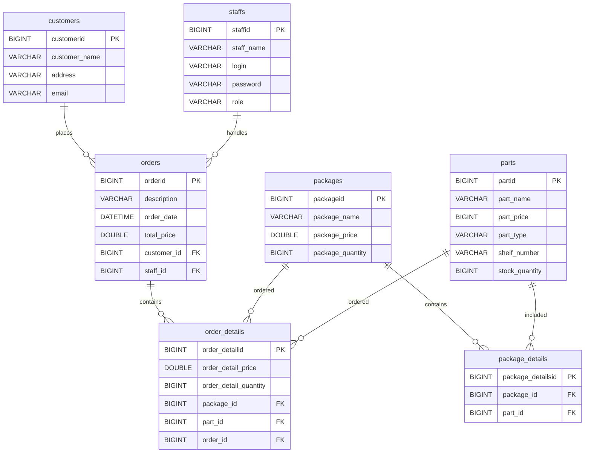

## Quick-Start Deployment Checklist

### Development

```text
- Create or update the feature branch
- Push the feature branch to GitHub
- Create Pull Request: feature → dev
- Wait for CI to pass
- Merge into dev
- CI runs on dev
- CD connects to Oracle
- git pull --ff-only origin dev
- Build and start pcstore-dev
- Check Development containers
- Test https://dev.pcstore-manager.uk
```

Development deployment:

```bash
cd ~/WebApp-PcStore-Backend-dev

git pull --ff-only origin dev

docker compose \
  -p pcstore-dev \
  --env-file .env.dev \
  -f docker-compose.oracle.yml \
  up -d --build

docker compose -p pcstore-dev ps
```

Expected Development containers:

```text
pcstore-dev-nginx-1
pcstore-dev-frontend-1
pcstore-dev-backend-1
pcstore-dev-mysql-1
```

Development database:

```text
pcstore_dev
```

Development ports:

```text
8081 → Nginx HTTP
8443 → Nginx HTTPS
```

---

### Production

```text
- Verify Development is working
- Create Pull Request: dev → main
- Wait for CI to pass
- Merge into main
- CI runs on main
- CD connects to Oracle
- git pull --ff-only origin main
- Build and start Production
- Check Production containers
- Test https://pcstore-manager.uk
```

Production deployment:

```bash
cd ~/WebApp-PcStore-Backend

git pull --ff-only origin main

docker compose \
  -f docker-compose.oracle.yml \
  up -d --build

docker compose ps
```

Production database:

```text
pcstore
```

Production ports:

```text
80  → Nginx HTTP
443 → Nginx HTTPS
```

---

### If Database Data Must Be Updated

```text
- Create the SQL dump
- Copy the dump to Oracle
- Verify the target database
- Load the SQL dump into pcstore_dev
- Verify the imported tables/data
- Test the Development application
```

Example:

```bash
scp dev.sql oracle-vm:~/dev.sql
```

Then:

```bash
MYSQL_PWD="$MYSQL_PASSWORD" docker exec -i \
  -e MYSQL_PWD \
  pcstore-dev-mysql-1 \
  mysql -u vadimzu_dev pcstore_dev < ~/dev.sql
```

---

### Quick Verification

After deployment:

```bash
docker compose -p pcstore-dev ps
```

or for Production:

```bash
docker compose ps
```

All required containers should show:

```text
Up
```

The MySQL container should additionally show:

```text
healthy
```

Then verify the application through the appropriate domain:

```text
Development:
https://dev.pcstore-manager.uk

Production:
https://pcstore-manager.uk
```


# PcStore Manager

PcStore Manager is a web application for managing customers, orders, packages, parts, and staff.

The application is built with a React frontend, Spring Boot backend, and MySQL database. Docker is used to run the application components in isolated containers.

---

# Docker Architecture

The application consists of separate Docker containers for:

* Frontend
* Backend
* MySQL database
* Nginx reverse proxy

Production and Development run on the same Oracle VM, but they are completely isolated environments with separate containers, Compose projects, configuration, and databases.

```text
                              BROWSER
                                 │
                                 │ HTTPS :443
                                 ▼
                 ┌───────────────────────────────┐
                 │        Production Nginx       │
                 │ webapp-pcstore-backend-nginx-1│          ← Production Nginx
                 │                               │            (External Reverse Proxy)
                 │  pcstore-manager.uk           │
                 │  dev.pcstore-manager.uk       │
                 └──────────────┬────────────────┘
                                │
                  ┌─────────────┴─────────────┐
                  │                           │
                  ▼                           ▼
           PRODUCTION                  DEVELOPMENT
      pcstore-manager.uk          dev.pcstore-manager.uk
                  │                           │                  
          :8080   │ :80                       │
          ┌───────┴───────┐           proxy_pass
          │               │         http://dev-nginx:80     ← "dev-nginx" is a network alias
          ▼               ▼                   │               for "pcstore-dev-nginx-1"
      /api/*              /*                  ▼
          │               │         ┌────────────────────┐
          ▼               ▼         │    Dev Nginx       │
      Backend          Frontend     │pcstore-dev-nginx-1 │  ← Development Nginx (Internal Reverse Proxy)
    Spring Boot       React/Nginx   │                    │        
          │                         └───────┬────────────┘          
          │                           :8080 │ :80                   
          ▼                         ┌───────┴───────┐               
      MySQL                      /api/*             /*
     pcstore                        │                │
                                    ▼                ▼
                                 Backend          Frontend
                               Spring Boot       React/Nginx
                                    │
                                    ▼
                                  MySQL
                               pcstore_dev
```
Dev Nginx is connected to the Production Docker network.
This allows Production Nginx to reach Dev Nginx and forward
requests for dev.pcstore-manager.uk using the "dev-nginx" alias.

"dev-nginx" is a Docker DNS alias for "pcstore-dev-nginx-1".
  
Each environment has its own:

* Nginx container
* Frontend container
* Backend container
* MySQL container
* Docker Compose project
* database

There is no direct connection between the Production and Development application containers or databases.

---

# Project Structure

```text
web-pcstore/
├── backend/
│   ├── Dockerfile
│   ├── pom.xml
│   └── src/
│
├── frontend/
│   ├── Dockerfile
│   ├── nginx.conf
│   ├── package.json
│   └── src/
│
├── nginx/
│   ├── nginx.conf
│   └── nginx.local.conf
│
├── .github/
│   └── workflows/
│
├── docker-compose.yml
├── docker-compose.oracle.yml
└── .env
```

---

# Dockerfiles

## `backend/Dockerfile`

Builds and runs the Spring Boot backend.

The backend application runs on port `8080` inside the Docker network.

## `frontend/Dockerfile`

Builds the React application and serves the production build using Nginx.

The frontend container exposes port `80`.

## `frontend/nginx.conf`

Configures the Nginx server inside the frontend container.

It serves the React static files and supports client-side routing.

---

# Nginx Architecture

There are two levels of Nginx in the deployment architecture.

## Frontend Nginx

The frontend container contains Nginx and serves the compiled React application:

```text
Frontend container
        │
        ▼
Nginx :80
        │
        ▼
React static files
```

## Application Nginx

The separate application Nginx container acts as the reverse proxy.

It routes:

```text
/api/*  → backend:8080
/*      → frontend:80
```

The application Nginx is also responsible for HTTPS configuration and SSL certificates.

---

# Local Nginx Configuration

### `nginx/nginx.local.conf`

Used when running the application locally.

The local configuration does not require the production SSL setup.

Traffic is routed as:

```text
/api/* → backend:8080
/*     → frontend:80
```

The local application is available at:

```text
http://localhost
```

---

# Oracle Nginx Configuration

### `nginx/nginx.conf`

Used for the Oracle deployment.

It provides:

* HTTPS
* SSL certificate configuration
* reverse proxy routing
* frontend routing
* backend API routing

Production and Development use separate Nginx containers.

---

# Production and Development Ports

Both environments run on the same Oracle VM.

Production uses the standard HTTP/HTTPS ports:

```text
80
443
```

Development uses different host ports:

```text
8081
8443
```

The Development `.env.dev` file on Oracle contains:

```env
NGINX_HTTP_PORT=8081
NGINX_HTTPS_PORT=8443
```
The Production `.env` file on Oracle contains:

```env
NGINX_HTTP_PORT=80
NGINX_HTTPS_PORT=443
```

These values are used by `docker-compose.oracle.yml`:

```yaml
nginx:
  image: nginx:alpine
  restart: unless-stopped
  ports:
    - "${NGINX_HTTP_PORT}:80"
    - "${NGINX_HTTPS_PORT}:443"
```

Therefore Docker creates the following port mappings:

```text
Oracle host             Development Nginx container

8081 ─────────────────► 80
8443 ─────────────────► 443
```

This allows Development and Production to use the same Oracle VM without trying to bind both Nginx containers to ports `80` and `443`.

The development domain is:

```text
https://dev.pcstore-manager.uk
```

---

# Docker Network

The Development Nginx container is connected to two Docker networks.

```yaml
networks:
  default:

  production_proxy:
    aliases:
      - dev-nginx
```

The default Compose network allows the Development Nginx to communicate with:

```text
frontend:80
backend:8080
```

The external `production_proxy` network allows the external Nginx infrastructure to reach the Development Nginx container.

The alias:

```text
dev-nginx
```

provides a predictable DNS name for the Development Nginx container on the `production_proxy` network.

Conceptually:

```text
                    External Nginx
                          │
                          │ production_proxy
                          ▼
                     dev-nginx
                    Development
                       Nginx
                          │
                 ┌────────┴────────┐
                 ▼                 ▼
             frontend           backend
                :80               :8080
```

---

# Docker Compose

## `docker-compose.yml`

Contains the common application architecture:

* MySQL
* Backend
* Frontend
* Nginx
* persistent MySQL volume

The MySQL data is stored in a Docker volume so that recreating the MySQL container does not remove the database data.

## `docker-compose.oracle.yml`

Contains Oracle-specific configuration, including:

* Oracle Nginx configuration
* host port mappings
* SSL certificate mounts
* external `production_proxy` network
* `dev-nginx` network alias

---

# Environment Variables

Sensitive configuration is stored outside Git.

Production and Development use separate environment files.

Development on Oracle uses:

```text
.env.dev
```

The database configuration includes:

```env
MYSQL_DATABASE=pcstore_dev
MYSQL_USER=vadimzu_dev
MYSQL_PASSWORD=...
```

and:

```env
NGINX_HTTP_PORT=8081
NGINX_HTTPS_PORT=8443
```

The `.env.dev` file is not committed to Git.

---

# Local Development

Start the local application:

```bash
docker compose up -d --build
```

Check the running containers:

```bash
docker compose ps
```

The local application is available at:

```text
http://localhost
```

---

# Oracle Deployment

The Oracle server contains two application directories.

Production:

```text
~/WebApp-PcStore-Backend
```

Development:

```text
~/WebApp-PcStore-Backend-dev
```

Production uses the `main` branch.

Development uses the `dev` branch.

---

# Development Deployment

The Development environment uses the Compose project name:

```text
pcstore-dev
```

Typical command:

```bash
docker compose \
  -p pcstore-dev \
  --env-file .env.dev \
  -f docker-compose.oracle.yml \
  up -d --build
```

Check the Development containers:

```bash
docker compose -p pcstore-dev ps
```

The Development environment uses:

```text
Frontend
Backend
MySQL
Nginx
```

and the database:

```text
pcstore_dev
```

---

# Production Deployment

Production uses the default Compose project and the `main` branch.

```bash
docker compose \
  -f docker-compose.oracle.yml \
  up -d --build
```

The production database is:

```text
pcstore
```

---

# Git Workflow

The project uses the following branch structure:

```text
feature → dev → main
```

Feature branches are used for new functionality and fixes.

## Create a Feature Branch

Modern Git syntax:

```bash
git switch -c feature/update-dashboard
```

The older equivalent is:

```bash
git checkout -b feature/update-dashboard
```

Check the current branch:

```bash
git branch --show-current
```

Commit changes:

```bash
git add .
git commit -m "Update dashboard"
```

Push the feature branch:

```bash
git push -u origin feature/update-dashboard
```

Then create a Pull Request:

```text
feature/update-dashboard → dev
```

---

# CI/CD Pipeline

The project uses the following workflow:

```text
       ┌──────────────┐
       │    feature   │
       └──────┬───────┘
              │
              │ push branch
              ↓
       ┌──────────────┐
       │    GitHub    │
       └──────┬───────┘
              │
              │ PR → dev
              ↓
     ┌──────────────────────┐
     │ CI on PR             │
     │                      │
     │ docker-build ✓       │
     │ ├─ backend           │
     │ └─ frontend          │
     └──────────┬───────────┘
                │
                │ merge → dev
                ↓
       ┌──────────────────┐
       │       dev        │
       └────────┬─────────┘
                │
                │ push / merge
                ↓
     ┌──────────────────────┐
     │ CI on dev             │
     │                       │
     │ docker-build ✓        │
     │ ├─ backend            │
     │ └─ frontend            │
     └──────────┬────────────┘
                │
                │ CD
                ↓
┌────────────────────────────────────────────────────────────┐
│                 CD — Development                           │
│                                                            │
│ SSH → Oracle                                               │
│ git pull --ff-only origin dev                              │
│ docker compose -p pcstore-dev                              │
│   --env-file .env.dev                                      │
│   -f docker-compose.oracle.yml up -d --build               │
└──────────────────┬─────────────────────────────────────────┘
                   │
                   ↓
       ┌──────────────────────┐
       │ Oracle — DEV         │
       │                      │
       │ dev.pcstore-         │
       │ manager.uk           │
       │                      │
       │ Application ✓        │
       └──────────┬───────────┘
                  │
                  │ testing
                  ↓
       ┌──────────────────┐
       │       dev        │
       └────────┬─────────┘
                │
                │ PR → main
                ↓
     ┌──────────────────────┐
     │ CI on PR             │
     │                      │
     │ docker-build ✓       │
     │ ├─ backend           │
     │ └─ frontend          │
     └──────────┬───────────┘
                │
                │ merge → main
                ↓
       ┌──────────────────┐
       │       main       │
       └────────┬─────────┘
                │
                │ push / merge
                ↓
     ┌──────────────────────┐
     │ CI on main            │
     │                       │
     │ docker-build ✓        │
     │ ├─ backend            │
     │ └─ frontend            │
     └──────────┬────────────┘
                │
                │ CD
                ↓
┌────────────────────────────────────────────────────────────┐
│                 CD — Production                            │
│                                                            │
│ SSH → Oracle                                               │
│ git pull --ff-only origin main                             │
│ docker compose -f docker-compose.oracle.yml                │
│   up -d --build                                            │
└──────────────────┬─────────────────────────────────────────┘
                   │
                   ↓
       ┌──────────────────────┐
       │ Oracle — PRODUCTION  │
       │                      │
       │ pcstore-manager.uk   │
       │                      │
       │ Application ✓        │
       └──────────────────────┘
```

## CI

CI verifies that the Docker images can be built successfully.

The pipeline builds:

```text
Backend
Frontend
```

CI runs for Pull Requests and branch updates according to the GitHub Actions workflow configuration.

## CD

CD deploys the corresponding branch to Oracle.

```text
dev  → WebApp-PcStore-Backend-dev
main → WebApp-PcStore-Backend
```

The server updates the repository using:

```bash
git pull --ff-only origin dev
```

or:

```bash
git pull --ff-only origin main
```

`--ff-only` prevents Git from automatically creating a merge commit on the deployment server. The server is expected to follow the remote branch rather than contain independent commits.

---

# GitHub Secrets

GitHub Actions uses the following repository secrets for SSH access to Oracle:

```text
ORACLE_HOST
ORACLE_USER
ORACLE_SSH_KEY
```

The same SSH credentials are used for both Development and Production.

The deployment environment is determined by the Git branch:

```text
dev
 │
 └── ~/WebApp-PcStore-Backend-dev


main
 │
 └── ~/WebApp-PcStore-Backend
```

Sensitive values are stored in GitHub Secrets and are not committed to the repository.

---

# Database

The application uses MySQL 8.0.

Production database:

```text
pcstore
```

Development database:

```text
pcstore_dev
```

The backend connects to MySQL through the Docker Compose service name:

```text
mysql:3306
```

---

# Database UML Diagram

The database consists of:

* customers
* staff
* orders
* order details
* packages
* package details
* parts

The relationships shown in the UML diagram correspond to the foreign-key constraints defined in the MySQL database.



The actual foreign-key relationships in MySQL are:

```text
orders.customer_id
    → customers.customerid

orders.staff_id
    → staffs.staffid

order_details.order_id
    → orders.orderid

order_details.package_id
    → packages.packageid

order_details.part_id
    → parts.partid

package_details.package_id
    → packages.packageid

package_details.part_id
    → parts.partid
```

---

# Database Import

A SQL dump can be imported into the Development database on Oracle.

For example, a local development database can be exported:

```bash
docker exec web-pcstore-mysql-1 \
  mysqldump -u vadimzu -p \
  --single-transaction \
  --routines \
  --triggers \
  pcstore > dev.sql
```

The resulting `dev.sql` can then be copied to Oracle:

```bash
scp dev.sql oracle-vm:~/dev.sql
```

---

# Loading `.env.dev`

Before using `MYSQL_PASSWORD` from `.env.dev`, load the variables into the current shell:

```bash
source ~/WebApp-PcStore-Backend-dev/.env.dev
```

This makes the variables from `.env.dev` available in the current shell session.

For example:

```bash
echo "$MYSQL_PASSWORD"
```

can be used to verify that the variable is loaded.

The variable can later be removed from the current shell:

```bash
unset MYSQL_PASSWORD
```

The shell `source` command is different from the MySQL `SOURCE` command described below.

---

# Importing `dev.sql`

The recommended import method is to stream the SQL file directly into the MySQL client inside the container:

```bash
MYSQL_PWD="$MYSQL_PASSWORD" docker exec -i \
  -e MYSQL_PWD \
  pcstore-dev-mysql-1 \
  mysql -u vadimzu_dev pcstore_dev < ~/dev.sql
```

The data flow is:

```text
Oracle host
    │
    │ ~/dev.sql
    │
    │ <
    ▼
MySQL client inside container
    │
    ▼
pcstore_dev
```

The `< ~/dev.sql` redirection is performed by the Oracle shell.

The SQL file does not need to be copied into the MySQL container.

`MYSQL_PWD` is used by the MySQL client for authentication.

The command:

```bash
MYSQL_PWD="$MYSQL_PASSWORD"
```

takes the password already loaded from `.env.dev`.

The option:

```bash
-e MYSQL_PWD
```

passes that environment variable into the Docker container.

---

# Alternative MySQL `SOURCE` Method

The SQL file can also be copied into the MySQL container:

```bash
docker cp ~/dev.sql pcstore-dev-mysql-1:/tmp/dev.sql
```

Then enter the MySQL client:

```bash
docker exec -it pcstore-dev-mysql-1 \
  mysql -u vadimzu_dev -p pcstore_dev
```

Inside MySQL:

```sql
SOURCE /tmp/dev.sql;
```

Here `SOURCE` is a **MySQL client command**. It reads SQL statements from the specified file and executes them.

This is different from the shell command:

```bash
source .env.dev
```

The two commands have completely different purposes:

```text
source .env.dev
        │
        └── Shell command
            loads environment variables


SOURCE /tmp/dev.sql
        │
        └── MySQL client command
            executes SQL from a file
```

---

# Docker Container Management

Check the containers:

```bash
docker compose ps
```

For the Development environment:

```bash
docker compose -p pcstore-dev ps
```

Show container creation time:

```bash
docker ps \
  --format 'table {{.Names}}\t{{.CreatedAt}}\t{{.Status}}'
```

Check the image used by a specific container:

```bash
docker inspect pcstore-dev-frontend-1 \
  --format 'Container image: {{.Image}}'
```

Check the current image:

```bash
docker image inspect pcstore-dev-frontend:latest \
  --format 'Latest image: {{.Id}}'
```

If the image ID used by the running container differs from the current image, the container is running an older image.

---

# Rebuilding Containers

Docker Compose does not rebuild an image if no relevant changes require a new image.

For example, if only the backend source code changed, rebuilding the backend does not require rebuilding the frontend image.

A complete rebuild can be performed with:

```bash
docker compose up -d --build
```

For the Development environment:

```bash
docker compose \
  -p pcstore-dev \
  --env-file .env.dev \
  -f docker-compose.oracle.yml \
  up -d --build
```

After rebuilding, check:

```bash
docker compose -p pcstore-dev ps
```

---

# Persistent MySQL Data

The MySQL data is stored in a Docker volume.

The volume is intentionally kept when containers are recreated so that rebuilding or restarting the MySQL container does not remove the database.

For Production, the database is:

```text
pcstore
```

For Development:

```text
pcstore_dev
```

The two databases are independent.

---

# Useful Docker Commands

Stop the application:

```bash
docker compose down
```

Start the application:

```bash
docker compose up -d
```

Rebuild and start:

```bash
docker compose up -d --build
```

View logs:

```bash
docker compose logs
```

Follow logs:

```bash
docker compose logs -f
```

View logs for one service:

```bash
docker compose logs -f backend
```

Check running containers:

```bash
docker compose ps
```

---

# Deployment Architecture Summary

```text
                         GitHub
                           │
              ┌────────────┴────────────┐
              │                         │
             dev                       main
              │                         │
              ▼                         ▼
     Oracle DEV directory      Oracle PROD directory
              │                         │
              ▼                         ▼
      pcstore-dev project        Production project
              │                         │
       ┌──────┼──────┐           ┌──────┼──────┐
       ▼      ▼      ▼           ▼      ▼      ▼
    Nginx  Frontend Backend    Nginx Frontend Backend
                      │                    │
                      ▼                    ▼
                  pcstore_dev           pcstore
```

The overall development flow is:

```text
Feature branch
      │
      ▼
   Pull Request
      │
      ▼
     dev
      │
      ▼
   CI + Docker build
      │
      ▼
 Development on Oracle
      │
      ▼
    Testing
      │
      ▼
   Pull Request
      │
      ▼
     main
      │
      ▼
   CI + Docker build
      │
      ▼
 Production on Oracle
```
