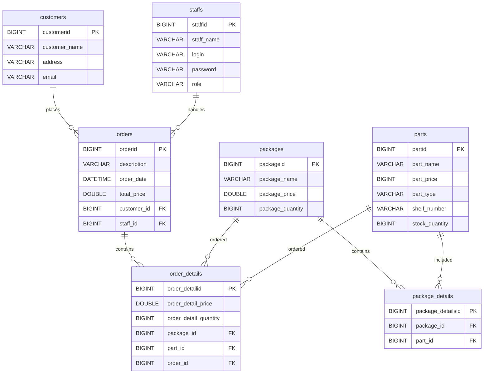

# Database
## Database Overview

The application uses MySQL 8.0.

## Database Entity-Relationship Diagram

The database contains the following main entities:

- Customers
- Staff
- Orders
- Order Details
- Packages
- Package Details
- Parts


## Database Import

A SQL dump can be imported into the database on Oracle.

For example, a local development database can be exported:

```bash
docker exec web-pcstore-mysql-1 \
  mysqldump -u vadimzu -p \
  --single-transaction \
  --routines \
  --triggers \
  pcstore > dev.sql
```

The resulting `dev.sql` can then be copied to Oracle:

```bash
scp dev.sql oracle-vm:~/dev.sql
```

## Loading `.env.dev`

Before using `MYSQL_PASSWORD` from `.env.dev`, load the variables into the current shell:

```bash
source ~/WebApp-PcStore-Backend-dev/.env.dev
```

This makes the variables from `.env.dev` available in the current shell session.

For example:

```bash
echo "$MYSQL_PASSWORD"
```

can be used to verify that the variable is loaded.

The variable can later be removed from the current shell:

```bash
unset MYSQL_PASSWORD
```

The shell `source` command is different from the MySQL `SOURCE` command described below.

---

## Importing `dev.sql`

The recommended import method is to stream the SQL file directly into the MySQL client inside the container:

```bash
MYSQL_PWD="$MYSQL_PASSWORD" docker exec -i \
  -e MYSQL_PWD \
  pcstore-dev-mysql-1 \
  mysql -u vadimzu_dev pcstore_dev < ~/dev.sql
```

The data flow is:

```text
Oracle host
    │
    │ ~/dev.sql
    │
    │ <
    ▼
MySQL client inside container
    │
    ▼
pcstore_dev
```

The `< ~/dev.sql` redirection is performed by the Oracle shell.

The SQL file does not need to be copied into the MySQL container.

`MYSQL_PWD` is used by the MySQL client for authentication.

The command:

```bash
MYSQL_PWD="$MYSQL_PASSWORD"
```

takes the password already loaded from `.env.dev`.

The option:

```bash
-e MYSQL_PWD
```

passes that environment variable into the Docker container.

---

# Alternative MySQL `SOURCE` Method

As an alternative, the SQL dump can be copied into the MySQL container and imported using the MySQL `SOURCE` command.

Copy the SQL file into the MySQL container:
```bash
docker cp ~/dev.sql pcstore-dev-mysql-1:/tmp/dev.sql
```

Then enter the MySQL client:

```bash
docker exec -it pcstore-dev-mysql-1 \
  mysql -u vadimzu_dev -p pcstore_dev
```
Inside MySQL, run:

```sql
SOURCE /tmp/dev.sql;
```

Here `SOURCE` is a **MySQL client command**. It reads SQL statements from the specified file and executes them.

This is different from the shell command:

```bash
source .env.dev
```

The two commands have completely different purposes:

```text
source .env.dev
        │
        └── Shell command
            loads environment variables


SOURCE /tmp/dev.sql
        │
        └── MySQL client command
            executes SQL from a file
```

